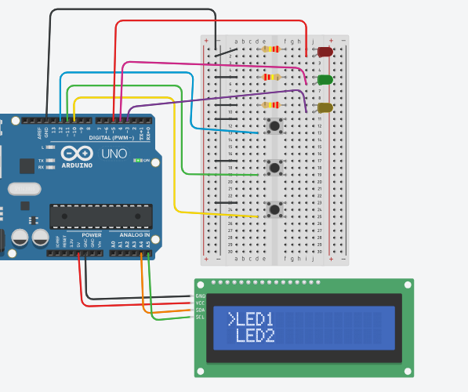
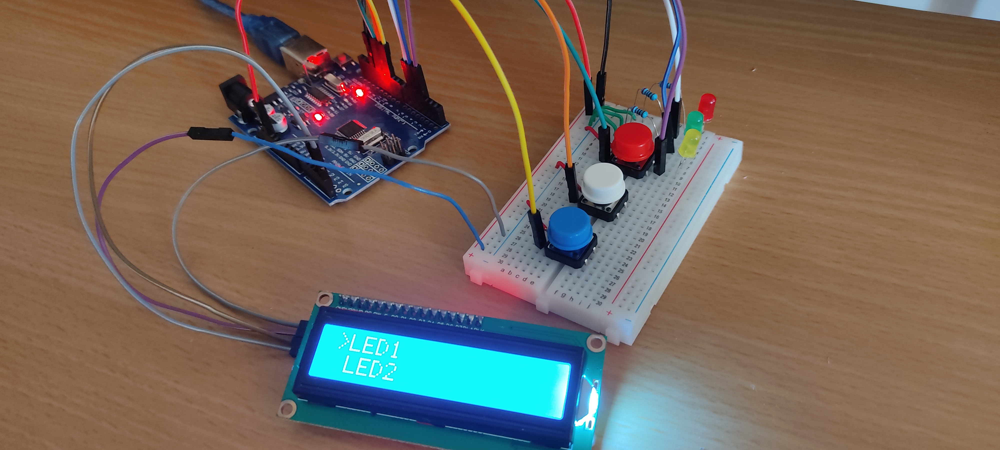

# Menu-LCD-Simple
Interfaz de usuario sencilla con Arduino UNO y una pantalla LCD para seleccionar opciones del menú. 
Para este proyecto se utilizan 3 botones para controlar el encendido/apagado de 3 luces LED.

## Componentes
- Arduino UNO
- Pantalla LCD I2C
- 3 botones
- 3 LEDs
- 3 resistencias de 220 ohm
- Protoboard
- Cables

## Diagrama

## Montaje
Para ver la demostración hacer click en la imagen de abajo.

